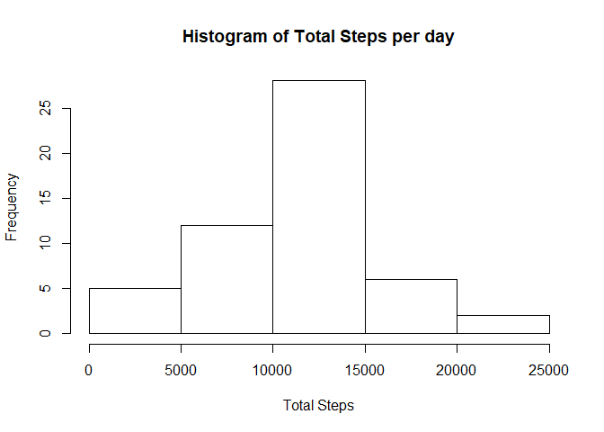
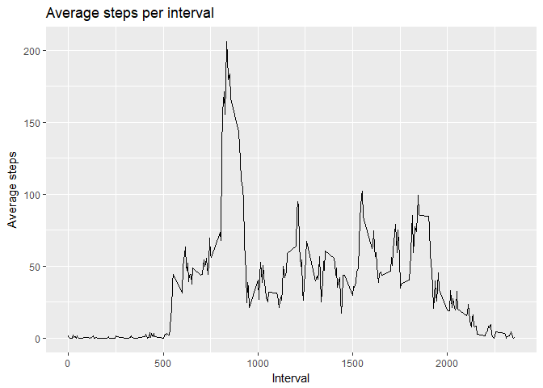
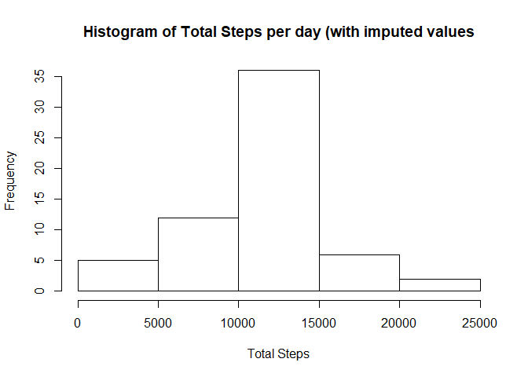
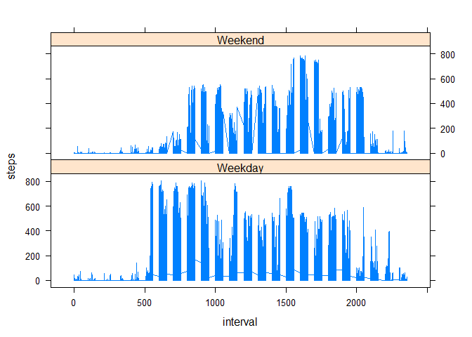

## Loading and preprocessing the data


```r
suppressMessages(library(plyr))
suppressMessages(library(dplyr))
suppressMessages(library(knitr))
```

```
## Warning: package 'knitr' was built under R version 3.4.4
```

```r
suppressMessages(library(ggplot2))
setwd("C:/Users/john.mcphillips/Google Drive/Coursera/Reproducible Research/Course Project 1")

# Read the data
repdata <- read.csv("activity.csv", header = TRUE)
repdata$date <- as.Date(repdata$date, format = "%Y-%m-%d")

repdata_bydate <- repdata %>%
  group_by(date) %>% 
  summarise_each(funs(sum, mean, median), steps)
```

```
## `summarise_each()` is deprecated.
## Use `summarise_all()`, `summarise_at()` or `summarise_if()` instead.
## To map `funs` over a selection of variables, use `summarise_at()`
```

```r
 repdata_byinterval <- repdata %>% group_by(interval) %>% summarise(mean_steps = mean(steps, na.rm = TRUE))
```

## What is mean total number of steps taken per day?

<!-- -->

The mean of the total steps per day is 1.0766189\times 10^{4} and the median is 10765

## What is the average daily activity pattern?

<!-- -->

The 5 minute interval on average that contains the maximum number of steps 
is 835

## Imputing missing values

There are 2304 rows out of `nrow(repdata)` that have missing values.

Impute the missing values by taking the mean number of steps for that interval across all days


```r
impute.mean <- function(x) replace(x, is.na(x), mean(x, na.rm = TRUE))
repdata_imputed <- ddply(repdata, ~ interval, transform, steps = impute.mean(steps))

repdata_imputed_bydate <- repdata_imputed %>%
  group_by(date) %>% 
  summarise_each(funs(sum, mean, median), steps)
```

```
## `summarise_each()` is deprecated.
## Use `summarise_all()`, `summarise_at()` or `summarise_if()` instead.
## To map `funs` over a selection of variables, use `summarise_at()`
```

<!-- -->

The mean of the total steps per day, with imputed values included, is 1.0766189\times 10^{4} and the median is 1.0766189\times 10^{4}


## Are there differences in activity patterns between weekdays and weekends?

Using the imputed values data set, I added a factor variable indicating whether the day was a weekday or weekend.


```r
repdata_imputed$weekday <- weekdays(repdata_imputed$date)

weekends <- c("Saturday", "Sunday")

repdata_imputed <- within(repdata_imputed, {
                    weored = as.factor(ifelse(is.na(match(weekday, weekends)) == TRUE, "Weekday", "Weekend" ))
})
```

Using this variable, I plotted graphs of steps per interval for Weekend vs. Weekday

<!-- -->

From this plot, we can see that on Weekdays, there tends to be more activity during the morning intervals (500 to 1000), whereas at the Weekend, activity only begins around interval 800, does not have as much activity but continues later in to the day than on a weekday. This perhaps indicates that this person has a weekday job, which requires 
a lot of walking, and recovers at the weekend by sleeping longer in the morning.
